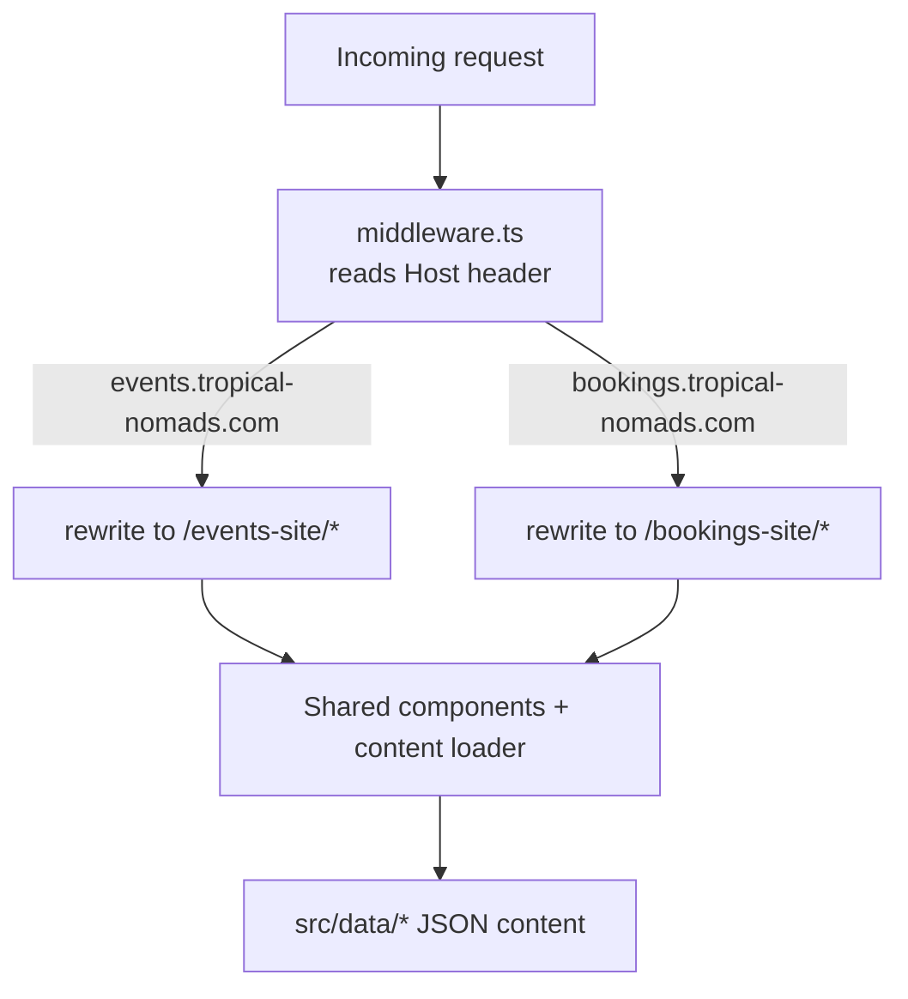
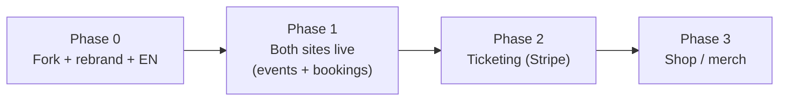

# Tropical Nomads — Project Context & Build Spec

> Single source of truth for building the Tropical Nomads websites. Hand this file to any new chat/agent as the starting context. It captures the vision, decisions already made, the tech stack, the architecture, what to reuse vs. build, the data model, content inventory, and a phased roadmap.

---

## 1. Vision

Tropical Nomads is an events company running parties across Europe, plus a DJ booking agency. We want two public-facing products under one brand and one domain (`tropical-nomads.com`, already owned):

- **`events.tropical-nomads.com`** — the events site: upcoming + past parties, photos/videos, a "next event" calendar, and a map of Europe showing where we throw parties. Later: sell tickets directly (to reduce fees/taxes) and run a merch shop.
- **`bookings.tropical-nomads.com`** — the agency site: roster of our DJs/artists, availability calendar, and a contact/booking flow to hire them.

---

## 2. Key Decisions (already made)

- **Codebase strategy:** Fork/copy the existing `forest-shankara-app` into a new `tropical-nomads` repo. Forest Shankara stays untouched; we inherit all its patterns and components.
- **Architecture:** One Next.js app. The two subdomains (`events` + `bookings`) are served from the same app via **subdomain routing in middleware** with shared UI components.
- **Language:** English only for now (no i18n routing). Keep copy centralized so multi-language can be added later if needed.
- **Domain:** `tropical-nomads.com` is already registered. We'll point `events.` and `bookings.` subdomains at the app.

---

## 3. Tech Stack (inherited from Forest Shankara)

- **Framework:** Next.js 15.5 (App Router, Turbopack), React 19, TypeScript (strict).
- **Styling:** Tailwind CSS v4, `tw-animate-css`.
- **UI:** shadcn/ui with full Radix primitives (`src/components/ui/*`), `lucide-react` icons, `embla-carousel-react` (galleries), `react-day-picker` (calendar), `sonner` (toasts), `vaul` (drawers).
- **Forms/validation:** `react-hook-form` + `zod` + `@hookform/resolvers`.
- **Email backend:** Resend via a server action (already implemented).
- **Analytics:** Google Analytics (gtag) already wired.
- **Deploy target:** Vercel (recommended — native subdomain + wildcard domain support).

---

## 4. Architecture

### 4.1 Multi-site via subdomain routing

The current repo already loads content per "tenant" using a `PARTY_KEY` env var, reading JSON from `src/data/<PARTY_KEY>/` (see `src/lib/content.ts`). We adapt this idea so the active **site** is chosen by **subdomain at request time** instead of a build-time env var.

- Add `middleware.ts` at the project root that reads the `Host` header and rewrites to the correct route group (e.g. `app/(events)/...` and `app/(bookings)/...`), or sets a `site` value the content loader reads.
- For **local dev**, support `events.localhost:3000` / `bookings.localhost:3000` (or a `?site=` query / path prefix fallback) so both sites are testable.
- Generalize the content loader: rename the concept from `PARTY_KEY` to a `site` selector (`events` | `bookings`) resolved from the subdomain. Keep the existing JSON-file pattern.

### 4.2 Content-driven JSON (keep this pattern)

All content stays as typed JSON loaded server-side, validated with zod schemas (`src/lib/schemas/*`). This keeps the site editable without a CMS initially. A headless CMS can be layered later if non-developers need to edit content.

---

## 5. Reuse vs. Build

### Reuse mostly as-is (after rebrand + English translation)
- **Artists/Lineup** pages (`src/app/(pages)/lineup/*`, `src/data/.../artists.json`, `src/lib/schemas/artist.ts`) → becomes the **bookings roster** and the **events lineup**.
- **Events** listing + detail (`src/app/(pages)/events/*`, `src/lib/schemas/event.ts`, `jsonld-event.tsx`).
- **Past editions / galleries** (`src/app/(pages)/ultimas-edicoes/*`, edition `gallery.json`, image-optimization scripts) → "Past Events" photo/video galleries.
- **Contact form + Resend email** (`src/app/(pages)/contact/*`) → reused for booking inquiries (extend fields).
- **Calendar** component (`src/components/ui/calendar.tsx`) → next-event countdown/calendar + agency availability.
- **SEO infra:** `sitemap.ts`, `robots.ts`, `seo.ts`, JSON-LD, Google Analytics.
- **Layout/shell:** header, footer, mobile nav, typography (rebrand colors + logo).

### Build new
- **Subdomain middleware** + generalized site/content loader (Section 4).
- **Europe map** with party-location pins (see Section 7).
- **Video support** in galleries (current galleries are image-first; add video embeds — YouTube/Vimeo/MP4).
- **Booking flow** specifics (artist availability, "request to book" form per artist).
- **Ticketing** (Phase 2) and **Shop/merch** (Phase 3).
- **Rebrand:** new logo, color palette, fonts; translate all copy from Portuguese → English; update nav (`src/lib/nav.ts`).

### Remove / replace when forking
- All Forest Shankara content under `src/data/forest-shankara/` and `public/forest-shankara/`.
- Portuguese nav labels and copy.
- Forest-specific SEO/branding and default contact email.

---

## 6. Site Maps

### events.tropical-nomads.com
- `/` — Home: hero, next event highlight + countdown, featured past-event media, Europe map teaser, CTA.
- `/events` — Upcoming events list.
- `/events/[slug]` — Event detail: lineup, date/venue, ticket CTA, JSON-LD.
- `/past` (past events / editions) — Gallery grid by event with photos + videos.
- `/past/[slug]` — Single past event gallery.
- `/map` — Europe map of all party cities (or embedded on Home/About).
- `/about` — About Tropical Nomads.
- `/contact` — General contact.
- (Phase 2) `/tickets` or per-event ticket checkout.
- (Phase 3) `/shop` — Merch.

### bookings.tropical-nomads.com
- `/` — Agency home: pitch, featured artists, "book us" CTA.
- `/artists` — Roster grid.
- `/artists/[slug]` — Artist profile: bio, music embeds (SoundCloud/Spotify/YouTube), photos, availability, "request booking" button.
- `/calendar` — Availability / tour calendar.
- `/contact` (or `/book`) — Booking inquiry form (artist, date, location, budget, message).

---

## 7. Europe Map

Show the cities where parties happen, with markers (past vs. upcoming).

- **Implementation options:**
  - `react-simple-maps` + a Europe TopoJSON (lightweight, fully styleable, no API key) — recommended.
  - A static custom SVG of Europe with absolutely-positioned pins (simplest, fully on-brand).
  - Leaflet / MapLibre with OSM tiles (interactive zoom/pan, heavier).
- **Data:** a `venues.json` with `{ city, country, lat, lng, status: "past" | "upcoming", count, events: [slug] }`.

---

## 8. Data Model (JSON, zod-validated)

Reuse/extend existing schemas in `src/lib/schemas/*`.

- **Artist** (`artist.ts`): `slug, name, role, tags[], country, photo, agency, bio[], links{instagram, soundcloud, spotify, youtube...}, embeds{soundcloud[], youtube[]}`. Extend for bookings: `availableForBooking: boolean`, `genres[]`, `pressKit?`, `fee?` (private).
- **Event** (`event.ts`): `slug, title, startDate, endDate, venue, city, country, lineup[], poster, ticketUrl?, status`.
- **Edition / Past event:** `meta.json`, `gallery.json` (images), add `videos[]`.
- **Venue / Map point:** new `venues.json` (Section 7).
- **General/site config:** per-site `config.json` (name, logo, colors, socials, SEO, ticket settings) and `general.json` (tickets, socials).

---

## 9. Content Inventory (from the brief — to confirm/expand)

### Past party cities (for map + past-events galleries)
- Dublin — multiple editions (brief mentioned ~4; confirm exact count).
- Amsterdam — 1.
- Berlin — 1.
- (Confirm the exact list and dates; brief was approximate.)

### Upcoming
- London — confirm date/venue.

### Artists / DJs (roster — details TBD)
- After June
- Shivaion
- Blazin'G
- (More to be added; gather bio, photo, social/music links per Section 8.)

> Media (photos/videos from previous events) and full artist details to be collected and dropped into the JSON + `public/` per site.

---

## 10. Ticketing (Phase 2)

Goal: sell tickets directly on the site to reduce third-party fees/taxes.

- **Options:**
  - **Stripe Checkout / Payment Links** + own order records — most control, lowest fees, but you handle ticket delivery (QR/PDF email via Resend) and check-in.
  - Third-party embed (Eventbrite, Tixr, DICE, Shotgun) — fastest, but higher fees (the thing we want to avoid).
- **Recommended:** Stripe Checkout per event, generate a QR e-ticket emailed via the existing Resend setup. Store orders (start with a serverless DB: Vercel Postgres / Supabase / Turso).
- **Note:** Direct ticket sales have VAT/tax + legal implications per country — get accounting/legal input before launch.

## 11. Shop / Merch (Phase 3)

- **Options:** Shopify (headless via Storefront API), Snipcart (drop-in cart), or Stripe + custom catalog.
- **Recommended starting point:** reuse the Stripe setup from ticketing for a simple merch catalog, or Snipcart for fastest cart/checkout. Revisit once ticketing is live.

---

## 12. Roadmap (phased)

- **Phase 0 — Foundation:** Fork repo → `tropical-nomads`. Add subdomain middleware + generalized site loader. Rebrand (logo, colors, fonts). Translate copy to English. Remove Forest Shankara content. Set up DNS subdomains + Vercel deploy.
- **Phase 1 — MVP sites:**
  - Events: Home, events list/detail, past-events galleries (photos + videos), Europe map, about, contact.
  - Bookings: roster, artist profiles with music embeds, availability calendar, booking inquiry form.
  - Populate real content (cities, artists, media).
- **Phase 2 — Ticketing:** Stripe checkout per event, QR e-tickets via Resend, order storage, basic admin/check-in.
- **Phase 3 — Shop:** merch catalog + checkout.

---

## 13. Open Questions / TODO before/while building

- Exact past-event list (cities, dates, edition counts) and confirmation of the Dublin count.
- London event date + venue.
- Full artist roster with bios, photos, and social/music links.
- Brand assets: logo files, color palette, fonts/typography direction.
- Map style preference (interactive vs. static stylized SVG).
- Hosting confirmation (Vercel assumed) + who manages DNS.
- For ticketing: business entity, payment processor account, tax/VAT handling per country.

---

## 14. Quick Start for a New Chat/Agent

1. Read this file top to bottom.
2. Confirm the current phase and pick the next unchecked roadmap item (Section 12).
3. Follow the inherited conventions: content as zod-validated JSON in `src/data/`, UI from `src/components/ui/*`, server actions for forms, App Router route groups per site.
4. Keep Forest Shankara patterns; just rebrand, translate to English, and add the new pieces (subdomain middleware, Europe map, ticketing, shop) as described.
